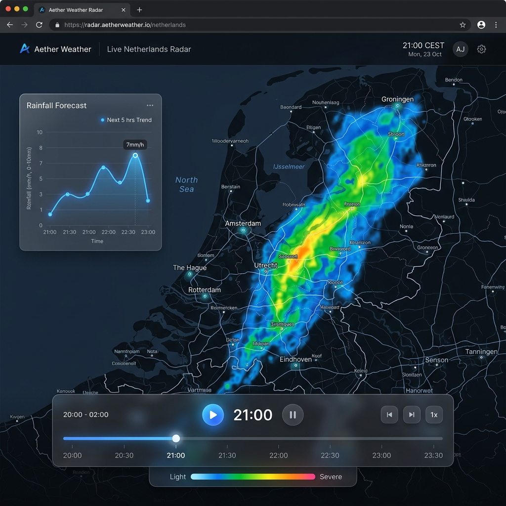

<div align="center">

# 🌧️ Weer

**Real-time precipitation ensemble forecast viewer for the Netherlands**

Built with Rust · Powered by [KNMI Open Data](https://developer.dataplatform.knmi.nl/)



</div>

---

## ✨ Features

- **20-member ensemble forecasts** — View individual members, median, maximum, or precipitation probability
- **Animated timeline** — Scrub through 6 hours of 5-minute forecast steps with adjustable playback speed
- **Interactive trend charts** — Click anywhere on the map to see a location-specific rainfall forecast graph
- **Live updates via MQTT** — Automatically syncs new forecast data from the KNMI notification service
- **GPU-accelerated rendering** — Fast client-side color-mapping and projection using WebGL

## 🏗️ Architecture

```
KNMI MQTT ──► Download Pipeline ──► NetCDF on disk
                                        │
                                        ▼
Browser ◄──── Axum HTTP Server ◄── Data Server
   │              │                     │
   │         /api/metadata         Raw grid data
   │         /api/data/:ens/:t     as packed PNG
   │         /api/value
   │         /api/timeseries
   │
   ▼
MapLibre + WebGL + Chart.js
```

| Component | Technology |
|-----------|-----------|
| Server | Rust, Axum, Tokio |
| Data | NetCDF (HDF5), KNMI Pysteps Blend |
| Data rendering | WebGL GPU-accelerated on-the-fly projection |
| Live sync | MQTT over WebSocket (rumqttc) |
| Frontend | Vanilla JS, MapLibre GL JS, Chart.js |

## 🚀 Quick Start

### Prerequisites

- [Rust](https://rustup.rs/) (1.70+)
- A [KNMI API key](https://developer.dataplatform.knmi.nl/)
- HDF5 system library (`sudo apt install libhdf5-dev` on Ubuntu)

### Setup

```bash
git clone https://github.com/your-username/weer.git
cd weer

# Configure your KNMI credentials
cp .env.example .env
# Edit .env with your API keys

# Run the service
cargo run --release
```

Open **http://localhost:8080** in your browser.

> [!NOTE]
> On first run, the service will connect to the KNMI MQTT notification service and automatically download the latest forecast dataset (~200 MB). Subsequent updates arrive every 5 minutes.

## 📡 API

| Endpoint | Description |
|----------|-------------|
| `GET /api/metadata` | Dataset dimensions, times, ensemble members |
| `GET /api/data/:ens/:time` | Raw packed radar data PNG (high byte -> Red, low byte -> Green) |
| `GET /api/value?ens=med&time=300&lat=52.1&lon=5.2` | Point value query |
| `GET /api/timeseries?ens=med&lat=52.1&lon=5.2` | Full forecast time series |

**Ensemble parameter** (`ens`): `med` · `max` · `prob` · `1`–`20`

## 📁 Project Structure

```
weer/
├── src/
│   ├── main.rs          # Server, API handlers, tile renderer, MQTT client
│   └── projection.rs    # Coordinate transforms (Mercator ↔ Polar Stereo)
├── static/
│   ├── index.html       # Single-page application shell
│   ├── app.js           # Map logic, animation, chart rendering
│   └── style.css        # Glassmorphic dark theme
├── .env.example         # Credential template
└── Cargo.toml
```

## 📜 License

MIT
