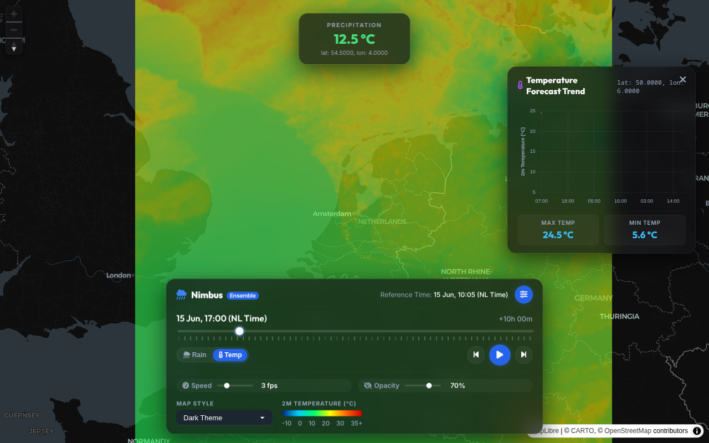
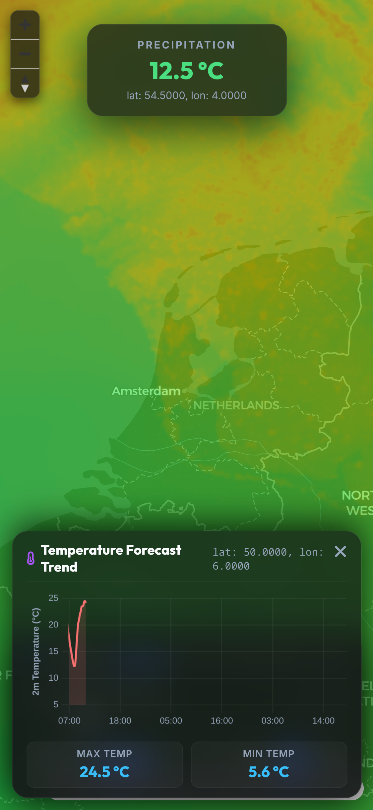

<div align="center">

# 🌦️ Nimbus

**High-performance, GPU-accelerated real-time precipitation ensemble, temperature, wind stream, and solar forecast engine for the Netherlands.**

[](https://github.com/Yannicked/Nimbus/actions/workflows/ci.yml)
[](LICENSE)
[](https://www.rust-lang.org/)
[](mobile/)
[](static/)
[](https://developer.dataplatform.knmi.nl/)
[](Dockerfile)

<br />

<p align="center">
  
</p>

<p align="center">
  
  &nbsp;&nbsp;
  
</p>

</div>

---

## 📖 Overview

**Nimbus** is a modern meteorological intelligence platform and radar server built in Rust and WebGL. It streams high-resolution weather data from the Royal Netherlands Meteorological Institute ([KNMI](https://www.knmi.nl/)), performing sub-millisecond projection re-mapping and serving lossless, GPU-decodable textures directly to interactive web and mobile interfaces.

By leveraging 20-member precipitation ensemble forecasts, KNMI Harmonie-AROME numerical models, and GPU-driven particle advection, Nimbus transforms complex multi-dimensional NetCDF and GRIB1 datasets into fluid, intuitive visualisations.

---

## ✨ Features

- 🌧️ **20-Member Precipitation Ensemble Forecasts**
  - High-resolution seamless blend across the Netherlands.
  - View individual ensemble members (`1`–`20`), median (`med`), maximum (`max`), or precipitation probability (`prob`).
  - 6-hour forecast timeline at 5-minute intervals with real-time radar actuals backfill.

- 🌡️ **Harmonie-AROME Atmospheric Layers**
  - **Temperature**: 2m surface temperature fields with smooth bilinear sampling.
  - **Wind Vector Field**: Multi-altitude wind speeds and directions with real-time GPU particle simulation.
  - **Solar Irradiance**: Global radiation maps for solar energy forecasting.

- ⚡ **Lossless RG-Packed WebP Transport**
  - Encodes 16-bit precision meteorological variables into the Red and Green channels of WebP images.
  - Minimises network payload size while enabling sub-millisecond on-GPU decoding via custom GLSL shaders.

- 🔄 **Event-Driven MQTT Pipeline**
  - Direct WebSocket connection to KNMI Open Data MQTT notification services.
  - Automatic, zero-latency ingestion of new radar runs, actuals, and weather model cycles without polling.

- 📈 **Interactive Location Analytics**
  - Click or tap anywhere on the map to inspect instant point values and 48-hour forecast trend curves.

- 📱 **Cross-Platform Ecosystem**
  - Modern, responsive glassmorphic web dashboard (MapLibre GL JS + WebGL + Chart.js).
  - Dedicated companion Flutter mobile application for Android & iOS.

---

## 🏛️ Architecture

```
                                ┌────────────────────────────────────────┐
                                │            KNMI MQTT Broker            │
                                └───────────────────┬────────────────────┘
                                                    │
                                         Push Notification Event
                                                    │
                                                    ▼
┌────────────────────────────────────────────────────────────────────────────────────────────────┐
│ Rust Axum Backend                                                                              │
│                                                                                                │
│  ┌────────────────────────┐      Ingest / Cache  ┌─────────────────┐                           │
│  │   MQTT Listeners       ├─────────────────────►│  Local Storage  │                           │
│  │  (rumqttc WebSockets)  │                      │  (.nc / .bin)   │                           │
│  └────────────────────────┘                      └────────┬────────┘                           │
│                                                           │                                    │
│                                                           ▼                                    │
│  ┌────────────────────────┐      Precalculated   ┌─────────────────┐      Parallel Rayon       │
│  │    Axum API Router     │◄─────────────────────┤ In-Memory Cache │◄─────────────────────────┐│
│  │  (REST JSON / WebP)    │                      │  (LUT & Slices) │                          ││
│  └───────────▲────────────┘                      └─────────────────┘                          ││
│              │                                                                                ││
│              │ HTTP / Tile Requests                                                           ││
└──────────────┼────────────────────────────────────────────────────────────────────────────────┼┘
               │
               │ (/api/metadata, /api/data/*, /api/timeseries, /api/value)
               │
               ▼
┌────────────────────────────────────────────────────────────────────────────────────────────────┐
│ Client Visualisation Layer                                                                     │
│                                                                                                │
│  ┌────────────────────────┐      WebP Stream     ┌─────────────────┐      GPU Shaders         │
│  │   MapLibre GL JS /     ├─────────────────────►│  WebGL Textures │─────────────────────────┐│
│  │   Flutter Map View     │                      │ (Decode RG->u16)│                         ││
│  └────────────────────────┘                      └─────────────────┘                         ││
│                                                           │                                  ▼│
│  ┌────────────────────────┐                               ▼                      ┌─────────────────┐
│  │        Chart.js        │◄─────────────────────────────────────────────────────┤ Particle Stream │
│  │   Timeseries Trends    │                                                      │ & Custom Layer  │
│  └────────────────────────┘                                                      └─────────────────┘
└────────────────────────────────────────────────────────────────────────────────────────────────┘
```

---

## 🛠️ Tech Stack

| Layer | Technologies |
|---|---|
| **Backend Core** | [Rust](https://www.rust-lang.org/) (2021 Edition), [Axum 0.8](https://github.com/tokio-rs/axum), [Tokio](https://tokio.rs/), [Rayon](https://github.com/rayon-rs/rayon) |
| **Data Ingestion** | [netcdf](https://crates.io/crates/netcdf) (HDF5), [grib-reader](https://crates.io/crates/grib-reader) (GRIB1), [rumqttc](https://crates.io/crates/rumqttc) (MQTT/TLS) |
| **Web Frontend** | Vanilla ES Modules, [MapLibre GL JS](https://maplibre.org/), WebGL 2.0 / GLSL, [Chart.js](https://www.chartjs.org/) |
| **Mobile App** | [Flutter](https://flutter.dev/) (Dart), Custom Native OpenGL Overlays (Android / iOS) |
| **Containerisation** | [Docker](https://www.docker.com/) (Multi-stage build), Docker Compose |

---

## 🚀 Quick Start

### Prerequisites

- [Rust](https://rustup.rs/) (1.70 or newer)
- NetCDF / HDF5 development libraries:
  - **Ubuntu / Debian**: `sudo apt-get install libnetcdf-dev libhdf5-dev`
  - **Arch Linux**: `sudo pacman -S netcdf hdf5`
  - **macOS**: `brew install netcdf hdf5`
- A free [KNMI Open Data Platform](https://developer.dataplatform.knmi.nl/) API Key

### Local Installation

1. **Clone the repository:**
   ```bash
   git clone https://github.com/Yannicked/Nimbus.git
   cd Nimbus
   ```

2. **Configure environment variables:**
   ```bash
   cp .env.example .env
   ```
   Open `.env` in your editor and add your KNMI credentials:
   ```dotenv
   KNMI_OPEN_DATA_API_KEY=your_open_data_api_key_here
   KNMI_MQTT_PASSWORD=your_mqtt_api_key_here
   ```

3. **Run the server:**
   ```bash
   cargo run --release
   ```

4. Open **`http://localhost:8080`** in your browser.

> [!NOTE]
> On the first startup, Nimbus automatically downloads the latest ensemble and numerical weather prediction datasets (~200 MB) from KNMI and initializes the projection Look-Up Tables. Subsequent updates arrive automatically via MQTT.

---

## 🐳 Docker Deployment

You can build and run Nimbus via Docker Compose:

```bash
# Ensure .env is populated with your KNMI credentials
docker compose up --build -d
```

To view logs:
```bash
docker compose logs -f
```

---

## 📱 Mobile Companion App

Nimbus includes a native Flutter client located in the [`mobile/`](mobile/) directory.

```bash
cd mobile
flutter pub get
flutter run
```

---

## 📡 REST API Reference

All endpoints return JSON or binary image data with appropriate CORS headers.

### Precipitation Ensemble

| Method | Endpoint | Description |
|---|---|---|
| `GET` | `/api/metadata` | Current dataset dimensions, timestamps, ensemble members, and bounds |
| `GET` | `/api/data/:ens/:time` | Lossless RG-packed radar tile WebP (`:ens`: `med`, `max`, `prob`, `1`–`20`) |
| `GET` | `/api/value?ens=med&time=300&lat=52.1&lon=5.2` | Single-point precipitation rate query (mm/h) |
| `GET` | `/api/timeseries?ens=med&lat=52.1&lon=5.2` | Complete 6-hour precipitation forecast timeseries for a coordinate |

### Harmonie-AROME (Temperature, Wind, Solar)

| Method | Endpoint | Description |
|---|---|---|
| `GET` | `/api/metadata/temp` | Available temperature forecast cycles and timestamps |
| `GET` | `/api/data/temp/:time` | Lossless RG-packed temperature slice WebP |
| `GET` | `/api/timeseries/temp?lat=52.1&lon=5.2` | 48-hour temperature trend for a coordinate |
| `GET` | `/api/metadata/wind` | Available wind forecast cycles and timestamps |
| `GET` | `/api/data/wind/:height/:time` | U/V vector packed WebP for wind speed/direction |
| `GET` | `/api/timeseries/wind?lat=52.1&lon=5.2` | Wind speed (m/s & Bft) and direction timeseries |
| `GET` | `/api/metadata/solar` | Solar radiation forecast metadata |
| `GET` | `/api/data/solar/:time` | Packed solar irradiance WebP ($W/m^2$) |
| `GET` | `/api/timeseries/solar?lat=52.1&lon=5.2` | Solar irradiance timeseries |

---

## 🔬 Technical Deep-Dive

<details>
<summary><b>1. Lossless RG-Packed WebP Protocol</b></summary>

Traditional map overlays stream pre-colored raster images, preventing client-side thresholding, dynamic color ramps, or client-side math. Nimbus encodes high-precision 16-bit unsigned integers (`u16`) into standard 8-bit Red and Green image channels:

$$\text{value}_{\text{raw}} = (\text{Red} \times 256) + \text{Green}$$

The WebGL fragment shader unpacks this value in zero overhead directly on the GPU, applying dynamic colormaps and threshold filters in real time.
</details>

<details>
<summary><b>2. Pre-calculated Projection Look-Up Tables (LUT)</b></summary>

KNMI raw data uses a Polar Stereographic projection, whereas modern web maps operate on Web Mercator (EPSG:3857). Converting coordinates per-pixel at runtime is computationally expensive. On startup, Nimbus computes a Bilinear Interpolation Look-Up Table mapping output Mercator grid cells to fractional input grid coordinates, allowing Rayon-powered multi-threaded slice slicing in milliseconds.
</details>

<details>
<summary><b>3. GPU Wind Particle Simulation</b></summary>

Wind vector simulation is executed on the GPU using Ping-Pong Framebuffer Objects (FBOs). Particle coordinates are packed into floating-point textures, advected along the U/V wind velocity vector field, and faded with an alpha decay buffer to render smooth streamline trails at 60 FPS.
</details>

---

## 🤝 Contributing

Contributions, issues, and feature requests are welcome!

1. Fork the repository
2. Create your feature branch (`git checkout -b feature/amazing-feature`)
3. Commit your changes (`git commit -m 'feat: add amazing feature'`)
4. Push to the branch (`git push origin feature/amazing-feature`)
5. Open a Pull Request

Please ensure code conforms to project formatting and linting:
```bash
cargo fmt --all -- --check
cargo clippy --all-targets -- -D warnings
```

---

## 🙏 Acknowledgements

- [KNMI Open Data Platform](https://developer.dataplatform.knmi.nl/) for providing open meteorological radar and NWP datasets.
- [MapLibre GL](https://maplibre.org/) for the open-source map rendering engine.

---

## 📜 License

Distributed under the **MIT License**. See [`LICENSE`](LICENSE) for more information.
